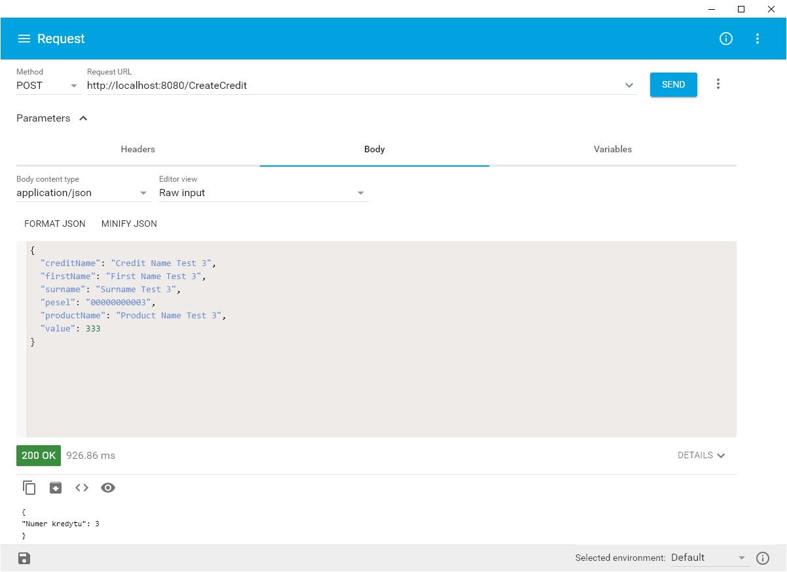
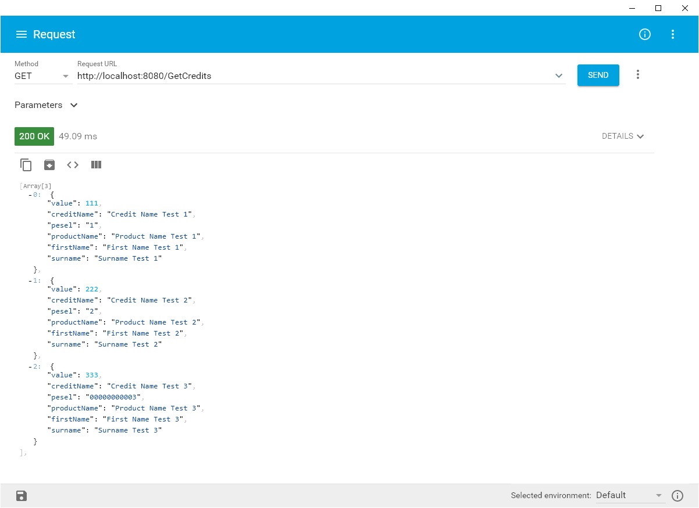

# MyTask
The application is used for post and get information about customer credit.

## Technologies
Project is created on Windows 10 within:
* Java: 8
* Apache Maven: 3.6.2
* Spring boot: 2.1.5.RELEASE
* MySQL: 
* Docker: 19.03.5

## Setup
Install Docker for Windows.

Before starting the project, check if docker is running and firewall is blocking file Sharing between Windows and the containers.

If not then write this in PowerShell on Windows
```
 Set-NetConnectionProfile -interfacealias "vEthernet (DockerNAT)" -NetworkCategory Private
```
Now you can start commpile project.

Go to folder MyTask in PowerShell and write:

```
PS C:\Users\patry\Documents\GitHub\MyTask>mvn clean install docker:build
[INFO] Scanning for projects...
[INFO] ------------------------------------------------------------------------
[INFO] Reactor Build Order:
[INFO]
[INFO] springboot-credit                                                  [jar]
[INFO] springboot-product                                                 [jar]
[INFO] springboot-customer                                                [jar]
[INFO] start-project                                                      [pom]
[INFO]
[INFO] --------------------< com.credit:springboot-credit >--------------------
[INFO] Building springboot-credit 1.0-SNAPSHOT                            [1/4]
[INFO] --------------------------------[ jar ]---------------------------------
[INFO]
.
.
.
[INFO] -----------------------< com.task:start-project >-----------------------
[INFO] Building start-project 1.0-SNAPSHOT                                [4/4]
[INFO] --------------------------------[ pom ]---------------------------------
[INFO]
[INFO] --- maven-clean-plugin:2.5:clean (default-clean) @ start-project ---
[INFO]
[INFO] --- maven-install-plugin:2.4:install (default-install) @ start-project ---
[INFO] Installing C:\Users\patry\Documents\GitHub\MyTask\pom.xml to C:\Users\patry\.m2\repository\com\task\start-project\1.0-SNAPSHOT\start-project-1.0-SNAPSHOT.pom
[INFO]
[INFO] --- docker-maven-plugin:1.2.1:build (default-cli) @ start-project ---
[INFO] Using authentication suppliers: [ConfigFileRegistryAuthSupplier]
[INFO] Property skipDockerBuild is set
[INFO] Skipping docker build
[INFO] ------------------------------------------------------------------------
[INFO] Reactor Summary for start-project 1.0-SNAPSHOT:
[INFO]
[INFO] springboot-credit .................................. SUCCESS [01:48 min]
[INFO] springboot-product ................................. SUCCESS [01:03 min]
[INFO] springboot-customer ................................ SUCCESS [01:06 min]
[INFO] start-project ...................................... SUCCESS [  0.604 s]
[INFO] ------------------------------------------------------------------------
[INFO] BUILD SUCCESS
[INFO] ------------------------------------------------------------------------
[INFO] Total time:  03:59 min
[INFO] Finished at: 2019-11-24T19:59:17+01:00
[INFO] ------------------------------------------------------------------------
```

next
```
PS C:\Users\patry\Documents\GitHub\MyTask>docker-compose up
Pulling database (mysql/mysql-server:5.7)...
5.7: Pulling from mysql/mysql-server
a316717fc6ee: Pull complete                                                                                                           b64762744f75: Pull complete                                                                                                           a1f742e3aa43: Pull complete                                                                                                           f71a5f0dcc26: Pull complete                                                                                                           Digest: sha256:5396bc60a6c08abb6b7e8350b255324a91ee9f3ea11f009aea3e4b61ead38bf6
Status: Downloaded newer image for mysql/mysql-server:5.7
Creating database ... done                                                                                                            Creating customer ... done                                                                                                            Creating product  ... done                                                                                                            Creating credit   ... done                                                                                                            Attaching to database, product, customer, credit
database    | [Entrypoint] MySQL Docker Image 5.7.28-1.1.13
database    | [Entrypoint] Initializing database
product     |
product     |   .   ____          _            __ _ _
product     |  /\\ / ___'_ __ _ _(_)_ __  __ _ \ \ \ \
product     | ( ( )\___ | '_ | '_| | '_ \/ _` | \ \ \ \
product     |  \\/  ___)| |_)| | | | | || (_| |  ) ) ) )
product     |   '  |____| .__|_| |_|_| |_\__, | / / / /
product     |  =========|_|==============|___/=/_/_/_/
product     |  :: Spring Boot ::        (v2.1.5.RELEASE)
.
.
.
.
database    | [Entrypoint] running /docker-entrypoint-initdb.d/database.sql
database    |
database    |
database    | [Entrypoint] Server shut down
database    |
database    | [Entrypoint] MySQL init process done. Ready for start up.
database    |
database    | [Entrypoint] Starting MySQL 5.7.28-1.1.13
```

## Example service calls
For test service calls i use google chrome application: Advanced REST client 
* https://chrome.google.com/webstore/detail/advanced-rest-client/hgmloofddffdnphfgcellkdfbfbjeloo?hl=pl

Example POST: CreateCredit



Example GET: GetCredits


## Author
* Patrycja Dyszczakowska


